# Weather as a price driver: Lithuanian day-ahead power prices, 2023–2026

Wind across the Baltic Sea region moves the Lithuanian day-ahead price more than any other weather variable, and the size of that effect depends strongly on interconnector availability. The results have five implications for Ignitis. Wind and residual load in Poland, Sweden and Finland, together with the state of the interconnectors, are as relevant to the price as Baltic wind: while the Estlink 2 cable was out (December 25, 2024 – June 20, 2025), the same amount of wind was associated with a 68% larger price reduction. Solar output is better valued at today's capture rate than at the historical one: a solar MWh earned 54% of the average price in January–August 2026, against 87% in the same months of 2023, while wind's share showed no downward trend. For battery scheduling, a forecast of the day's price shape appears sufficient: scheduled with our forecast, a battery earned 89% of the perfect-foresight profit, against 78% when repeating yesterday's prices – up to €2.8 million a year for Ignitis' 291 MW – while a 7% improvement in forecast accuracy added about €65,000. Better wind forecasts would not improve the day-ahead price forecast; their value is more likely to lie in intraday trading and balancing. Finally, correcting the grid operator's load forecast for rooftop solar would reduce its 2026 error by 30%.

These implications rest on five findings for January 2023 – September 2026. A typical windy hour was 17 €/MWh (19%) cheaper than a typical calm one (−7.6 €/MWh per +10 percentage points of Baltic wind capacity factor), and wind in the neighboring regions moved the price 98% as much as Baltic wind (−7.4 €/MWh per +10 percentage points). The increase in the wind effect in 2025 coincided with the Estlink 2 outage and is not explained by the turbines added. Solar's capture rate (output-weighted price ÷ average price) fell by 8.4 percentage points a year, and wind farms held back 18% of their output in negative-price hours, which represented 0.8% of their 2025 production. A forecast built on information available before the auction had a 41% lower error than repeating yesterday's prices (mean absolute error 24.6 against 41.8 €/MWh), and replacing its wind forecast with the wind that actually blew made it 2.5% worse.

The analysis joins 32,135 hourly prices with public weather, grid and fuel data in three notebooks – price drivers ([01](notebooks/01_price_drivers.ipynb)), the value of wind and solar ([02](notebooks/02_wind_value.ipynb)) and forecasting ([03](notebooks/03_forecast.ipynb)) – with methods in [Appendix A](#appendix-a-data-and-methods). The wind effect passes five independent checks; the forecast beat repeating yesterday's prices in every month from January to September 2026; and the improved forecast's 4% gain on the 26 days of September 2026 that no decision used is statistically uncertain (p = 0.04–0.19). The main caveats are listed in [section 14](#14-limits).

---

## 1. Recommendations

### 1.1 Trading

Polish, Swedish and Finnish wind and residual load are as relevant to the Lithuanian price as Baltic wind. Per +10 percentage points of capacity factor, Nordic wind lowered the Lithuanian price by 7.4 €/MWh and Baltic wind by 7.6 €/MWh ([section 3](#3-neighbors-wind-moves-the-lithuanian-price-98-as-much-as-baltic-wind)), and Poland's forecast residual load (load − wind − solar) was the most informative input of the forecast model, with 30% of its gain ([section 8](#8-a-forecast-from-pre-auction-information-had-a-41-lower-error-than-repeating-yesterdays-prices)).

An interconnector outage can change the relationship between wind and price. While Estlink 2 was out, +10 percentage points of Baltic wind were associated with a price reduction of 12.7 €/MWh instead of 7.6 €/MWh ([section 4](#4-while-estlink-2-was-out-the-same-wind-was-associated-with-a-68-larger-price-reduction-added-turbines-did-not-change-the-effect)). In August 2026, with only 162 MW (Poland to Lithuania) and 196 MW (Lithuania to Poland) offered on the link, Poland's price averaged 54.6 €/MWh above Lithuania's ([section 8](#8-a-forecast-from-pre-auction-information-had-a-41-lower-error-than-repeating-yesterdays-prices)).

Wind moves the price more when the system is tight. In the 30% of hours with the highest load forecast, +10 percentage points of wind lowered the price by 10.2 €/MWh, against 6.2 €/MWh in the other hours ([section 2](#2-a-typical-windy-hour-was-17-mwh-19-cheaper-than-a-typical-calm-one)).

The value of a better weather forecast is more likely to arise after the auction than in the day-ahead price forecast. Replacing the wind forecast with the wind that actually blew made the day-ahead price forecast 2.5% worse, and forecast errors explained 0.1% of the price forecast error ([section 12](#12-knowing-the-wind-that-actually-blew-made-the-forecast-25-worse)). Surprises in wind and demand are priced in the intraday and balancing markets.

### 1.2 Wind and solar assets

Solar PPA prices would be better anchored to the current capture rate than to historical values. Solar earned 54% of the average price in January–August 2026 (capture rate 0.54). A PPA priced on the capture rates of the same months in 2023 (0.87) or 2024 (0.75) would overvalue solar output by 60% or 39% ([section 6](#6-solars-capture-rate-fell-from-087-to-054-in-the-same-months-of-2023-and-2026-winds-did-not-fall)).

For wind PPAs, a capture rate of about 0.81 of the baseload price is a reasonable reference. In the full years 2024 and 2025 wind's capture rate was 0.81, a discount of about 16 €/MWh, with no downward trend (+0.25 percentage points a year, p = 0.74). For merchant wind, the larger risk is the average price itself, which ranged from 80 to 97 €/MWh across the January–August periods of 2023–2026 ([section 6](#6-solars-capture-rate-fell-from-087-to-054-in-the-same-months-of-2023-and-2026-winds-did-not-fall)).

A price floor near zero in wind offers, together with negative-price clauses in contracts, would formalize what the fleet already does. In negative-price hours wind farms held back 18% of their output; this represented 0.8–0.9% of annual wind output in 2024–2025 and avoided an estimated €81,700–109,400 a year in payments at negative prices ([section 7](#7-wind-farms-held-back-18-of-their-output-at-negative-prices-08-of-their-2025-production)).

A hybrid park does not raise the value of each MWh. Two-thirds wind and one-third solar would have earned a capture rate of 0.74 in 2025, the output-weighted average of wind's 0.81 and solar's 0.59; the benefits of a hybrid are a shared grid connection and a smoother output profile.

### 1.3 Storage

For storage scheduling, a forecast of the day's price shape captured 89% of the attainable profit, and a further 7% improvement in forecast accuracy added about €65,000 a year across 291 MW. A 1 MW / 2 MWh battery scheduled with our forecast earned €75,200 per MW and year, against €84,300 with perfect foresight; when repeating yesterday's prices, it earned 78% of the perfect-foresight profit. Across 291 MW the forecast is worth up to €2.8 million a year – an upper bound, measured against a benchmark that no trading desk uses ([section 11](#11-a-battery-scheduled-with-the-forecast-earned-89-of-the-perfect-foresight-profit)).

Storage revenue plans may need to allow for narrower spreads. In April–August the average price at 21:00 exceeded that at 14:00 by 115–135 €/MWh in 2024–2026, against about 75 €/MWh in 2023 ([section 6](#6-solars-capture-rate-fell-from-087-to-054-in-the-same-months-of-2023-and-2026-winds-did-not-fall)); the spread may narrow as additional storage capacity is deployed.

### 1.4 Load forecasting and supply

Correcting the grid operator's load forecast for rooftop solar would reduce its 2026 error by 30%. Subtracting the error that the solar forecast predicted over the previous 56 days cut the 2026 load forecast error from 138 to 97 MW ([section 13](#13-the-load-forecasts-error-grew-23-times-mostly-in-solar-hours-a-56-day-correction-cuts-it-by-30)).

---

## 2. A typical windy hour was 17 €/MWh (19%) cheaper than a typical calm one

With demand, solar, gas, Nordic hydro, regional wind and the calendar held fixed, +10 percentage points of Baltic wind capacity factor lowered the hourly price by 7.61 €/MWh (95% CI 6.73–8.49), 8% of the 90.8 €/MWh average ([01 §4](notebooks/01_price_drivers.ipynb)). Baltic wind runs from 5.7% at its 25th percentile to 28.6% at its 75th, so a typical calm-to-windy swing is 23 percentage points and lowered the price by 17.4 €/MWh, 19% of the average. The windiest tenth of hours was about 50 €/MWh cheaper than the calmest tenth ([01 §8.3](notebooks/01_price_drivers.ipynb)).

Higher wind generation lowers the price because wind has near-zero marginal cost and displaces the most expensive plant running in that hour. Each +10 percentage points lowered the price by about 13 €/MWh up to a capacity factor of 30%, and by about 4 €/MWh above it, because above 30% the price has already fallen to the flat bottom of the supply curve ([01 §8.3](notebooks/01_price_drivers.ipynb)). In the 30% of hours with the highest load forecast, where the price sits on the steep part of the curve, +10 percentage points lowered it by 10.2 €/MWh, against 6.2 €/MWh in the other hours (difference 4.0 €/MWh, p ≈ 0.003; [01 §8.13](notebooks/01_price_drivers.ipynb)).

Wind in the three regions together moved the price more than any other weather variable. Scaled by one typical swing (one standard deviation, within the same hour, month and year), Baltic, Nordic and Continental wind moved the price by 12.3, 7.7 and 6.9 €/MWh, 26.9 €/MWh together; solar radiation by 12.4 €/MWh, the same as Baltic wind alone; the load forecast by 15.8, gas by 3.9 and Nordic hydro by 2.9 €/MWh ([01 §4.1](notebooks/01_price_drivers.ipynb)).

Five independent checks support reading the 7.6 €/MWh as the effect of wind itself – a placebo with next week's wind, the ten wind deciles, an instrumental-variable estimate, an out-of-sample test and a leave-one-year-out test, detailed in [Appendix A.2](#a2-notebook-01-price-drivers). The 7.6 €/MWh is more likely to understate than overstate the effect, because ERA5 records the weather that occurred while the market clears on the forecasts made a day earlier.

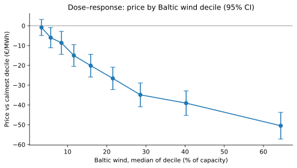

*Figure 1. Price by Baltic wind decile.* The windiest tenth of hours was about 50 €/MWh cheaper than the calmest ([01 §8.3](notebooks/01_price_drivers.ipynb)).

## 3. Neighbors' wind moves the Lithuanian price 98% as much as Baltic wind

Per +10 percentage points, Nordic wind lowered the Lithuanian price by 7.4 €/MWh and Continental wind by 5.3 €/MWh, against 7.6 €/MWh for Baltic wind; +10 percentage points in all three regions at once lowered it by 20.4 €/MWh (95% CI 18.6–22.2), 22% of the average price ([01 §5](notebooks/01_price_drivers.ipynb)). Lithuania trades power with Sweden through NordBalt (700 MW), with Finland through Estonia and the Estlink cables (350 and 650 MW), and with Poland. A windy day in any of these regions lowers the price at which Lithuania can import and raises the competition for its exports.

Leaving the neighbors out makes Baltic wind look 50% stronger than it is: −11.4 instead of −7.6 €/MWh ([01 §5](notebooks/01_price_drivers.ipynb)). Weather systems are regional – Lithuanian wind correlates 0.66 with Polish wind and Estonian wind 0.59 with Finnish – so a model with Baltic wind alone credits it with part of the neighbors' effect.

The Nordic effect ran through the two countries connected to the Baltic states. +10 percentage points in Sweden and Finland lowered the price by 4.6 €/MWh and +10 percentage points in Norway and Denmark by 3.1 €/MWh; Norway alone, which has no cable to the Baltic states, had no measurable effect (p = 0.47) ([01 §8.10](notebooks/01_price_drivers.ipynb)).

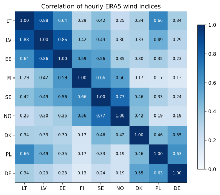

*Figure 2. Correlation of hourly wind between countries.* Highest within the Baltic states: 0.86–0.88 ([01 §2](notebooks/01_price_drivers.ipynb)).

## 4. While Estlink 2 was out, the same wind was associated with a 68% larger price reduction; added turbines did not change the effect

The effect of +10 percentage points of Baltic wind was −5.3 €/MWh in 2023, −7.1 in 2024, −11.1 in 2025 and −7.6 in January–August 2026 ([01 §6](notebooks/01_price_drivers.ipynb)); on January–August data it was −5.3, −3.3, −10.1 and −7.4 €/MWh ([01 §8.9](notebooks/01_price_drivers.ipynb)). The effect did not rise with each new turbine; it jumped in 2025 and fell back in 2026.

The number of turbines grew steadily, which does not fit a jump. Lithuania added 522 MW of onshore wind in 2024 and 759 MW in 2025, doubling its fleet to about 2.5 GW (Ignitis Group, 2026; WWEA). A steady yearly trend in the wind effect is −0.6 €/MWh a year and not significant (p = 0.43; [01 §8.11](notebooks/01_price_drivers.ipynb)). The effect of each 100 MW of actual wind output was −1.6 €/MWh in 2023 and −2.0 €/MWh in 2026, statistically the same (p = 0.62), with a peak of −4.3 €/MWh in 2025 ([01 §8.12](notebooks/01_price_drivers.ipynb)).

The increase coincided with the Estlink 2 outage and is consistent with an outage-driven change in the wind–price relationship. On December 25, 2024, a ship's anchor damaged Estlink 2, the 650 MW cable between Estonia and Finland; it returned to service on June 20, 2025, 177 days later (Elering, 2025; Helsinki Times, 2025). Without it, wind surpluses in the Baltic states had 650 MW less export capacity to the north, a plausible mechanism for the stronger effect. In March 2025, +10 percentage points of Baltic wind were associated with a price reduction of 12.7 €/MWh, against 7.6 €/MWh without the outage, 68% more (p < 0.001; [01 §8.11](notebooks/01_price_drivers.ipynb)). In August 2025, after the cable returned, the effect was −7.8 €/MWh. When each calendar month gets its own wind effect, the extra effect during the outage is −8.1 €/MWh (95% CI −11.5 to −4.6), so a winter pattern does not account for it.

The other changes of 2025 did not alter the wind effect measurably. After the Baltic balancing capacity market started on February 4, 2025 (AST, 2025) and the grid synchronized with Continental Europe on February 9, the wind effect changed by −1.3 €/MWh (p = 0.42). After the move to 15-minute day-ahead products on October 1, 2025 (NEMO Committee, 2025), it changed by −1.6 €/MWh (p = 0.39) ([01 §8.11](notebooks/01_price_drivers.ipynb)).

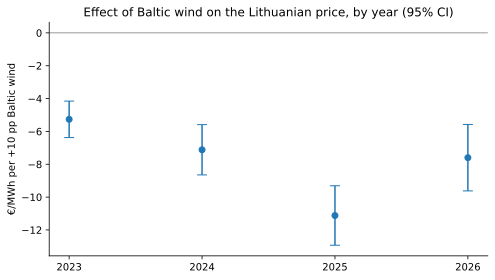

*Figure 3. Effect of +10 percentage points of Baltic wind, by year.* Largest in 2025, the year of the Estlink 2 outage ([01 §6](notebooks/01_price_drivers.ipynb)).

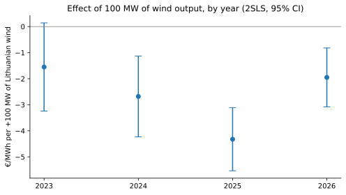

*Figure 4. Effect of 100 MW of wind output, by year.* −1.6 €/MWh in 2023, −2.0 €/MWh in 2026 ([01 §8.12](notebooks/01_price_drivers.ipynb)).

## 5. Gas prices and Nordic hydro did not change the wind effect

+10 €/MWh of gas raised the power price by 5.3 €/MWh, 27% of the 20 €/MWh a gas plant setting the price every hour would pass through at 50% efficiency, consistent with gas plants setting the Lithuanian price only in some hours, and imports and renewables in the others ([01 §4](notebooks/01_price_drivers.ipynb)). Expensive gas did not make wind more valuable either: in 2026, +10 percentage points of wind lowered the price by 7.0 €/MWh at a gas price of 28 €/MWh and by 7.8 €/MWh at 52 €/MWh, a difference that is not statistically significant (p = 0.39; [01 §7](notebooks/01_price_drivers.ipynb)), and not in tight hours either (p = 0.65; [01 §8.13](notebooks/01_price_drivers.ipynb)). H4 is not supported.

Nordic reservoirs 10 TWh above normal went with prices 5.0 €/MWh higher, the opposite of the expected effect, and with p = 0.049 when errors are clustered by month ([01 §8.8](notebooks/01_price_drivers.ipynb)). Reservoir levels partly reflect producers saving water before expensive periods, so they measure water management as well as weather, and Nordic water reaches Lithuania only through NordBalt and Estlink. H5 is not supported.

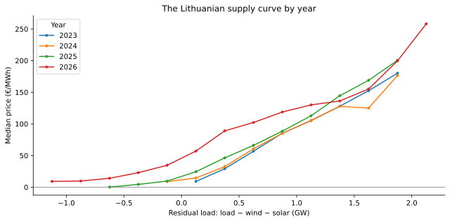

*Figure 5. Price against residual load.* Steep in tight hours, flat at low residual load ([01 §3](notebooks/01_price_drivers.ipynb)).

## 6. Solar's capture rate fell from 0.87 to 0.54 in the same months of 2023 and 2026; wind's did not fall

The capture rate is the average price a technology's output earns divided by the average price of all hours (the value factor of Hirth, 2013). Comparing the same months of each year ([02 §3.1](notebooks/02_wind_value.ipynb)):

| January–August | 2023 | 2024 | 2025 | 2026 |
|---|---|---|---|---|
| Average price, €/MWh | 91.9 | 86.8 | 80.0 | 97.0 |
| Wind capture rate | 0.885 | 0.850 | 0.814 | 0.901 |
| Wind discount to the average price, €/MWh | 10.6 | 13.0 | 14.8 | 9.6 |
| Solar capture rate | 0.867 | 0.750 | 0.556 | 0.541 |
| Solar discount to the average price, €/MWh | 12.2 | 21.7 | 35.5 | 44.5 |

In January–August 2023 a solar MWh earned 98% of what a wind MWh earned; in January–August 2026 it earned 60% (52.5 against 87.4 €/MWh). After removing the seasonal cycle from monthly data, solar's capture rate fell by 8.4 percentage points a year (95% CI 6.3–10.5), while wind's changed by +0.25 percentage points a year (p = 0.74) ([02 §3.3](notebooks/02_wind_value.ipynb)). Over full years, wind's capture rate was 0.83, 0.81 and 0.81 in 2023–2025 and solar's 0.90, 0.77 and 0.59. H7 is partly supported: solar's rate fell, wind's did not.

Solar's value fell as the fleet grew, consistent with cannibalization: all panels produce in the same hours, so added capacity lowers the price in the hours solar sells. Lithuania's solar fleet reached 3,040 MW by the end of 2025, and about 170,000 prosumers produced about 70% of the country's solar output (pv magazine, 2026). In April–August the average price at 14:00 fell from about 60 €/MWh in 2023 to 40 in 2024 and 20 in 2025, while the average price at 21:00 stayed between 135 and 175 €/MWh ([02 §3.4](notebooks/02_wind_value.ipynb)). Neighboring countries' solar lowers prices in the same hours through the coupled market (Stiewe et al., 2025). Wind follows weather systems rather than the clock, so its output is spread over day and night.

Negative prices moved to the solar hours. In January–August there were 53 negative-price hours in 2023, 125 in 2024 and 165 in 2025, and in 2025 one in ten 14:00 hours had a negative price ([02 §1](notebooks/02_wind_value.ipynb)). In January–August 2026 negative hours fell to 63, yet solar's capture rate still slipped from 0.556 to 0.541, because night prices rose by about 30 €/MWh against 2025 and midday prices by about 10 €/MWh. The fall has slowed: −1.5 percentage points from 2025 to 2026, against −11.7 and −19.4 percentage points in the two years before.

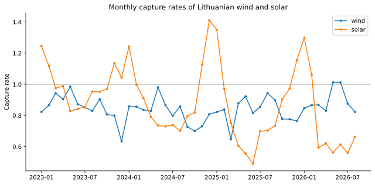

*Figure 6. Monthly capture rates of wind and solar.* Solar below wind since 2024 ([02 §3.2](notebooks/02_wind_value.ipynb)).

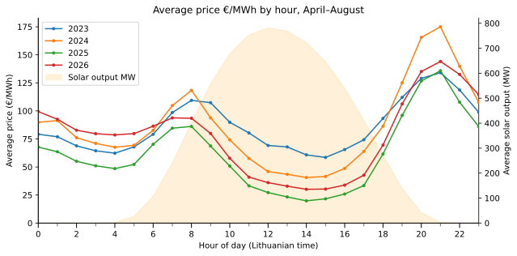

*Figure 7. Average price by hour, April–August.* The 14:00 price fell from about 60 to 20 €/MWh in 2023–2025 ([02 §3.4](notebooks/02_wind_value.ipynb)).

## 7. Wind farms held back 18% of their output at negative prices, 0.8% of their 2025 production

When the price was negative, wind output was 18% lower than in hours with a price of at least 10 €/MWh and the same expected output (95% CI 10–26%, p < 0.001; [02 §2.2](notebooks/02_wind_value.ipynb)). Expected output comes from the ERA5 wind index, so the comparison holds the weather fixed. In hours priced between 0 and 10 €/MWh, with similar weather and times of day but in which producing still pays, output was only 0.9% lower (95% CI −3.9 to 5.7%). Output drops where the price crosses zero, which is what farms stopping to avoid paying for their output would produce. H6 is supported.

Curtailment grew sixfold after 2023, as negative prices became more frequent and a larger share of available output was held back. Negative-price hours rose from 100 in 2023 to 186 in 2024 and 180 in 2025, and the share of available wind held back in those hours rose from 9.5% to 26.6% and 29.0% ([02 §2.3](notebooks/02_wind_value.ipynb)). The fleet held back about 52 MW per negative hour in 2023 and 164–216 MW in 2024–2026. Lost energy rose from 5.2 GWh in 2023 to 30.4 GWh in 2024 and 31.8 GWh in 2025, 0.9% and 0.8% of annual wind output.

By stopping, the fleet avoided an estimated €81,700 in 2024 and €109,400 in 2025 in payments at negative prices; the estimate is small because prices in the curtailed hours averaged only −2.7 and −3.4 €/MWh ([02 §3.6](notebooks/02_wind_value.ipynb)). It raised the wind capture rate by 0.8 and 0.7 percentage points in those years ([02 §3.5](notebooks/02_wind_value.ipynb)).

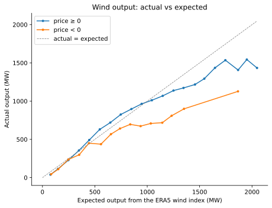

*Figure 8. Actual against expected wind output.* 20–30% lower in negative-price hours above 500 MW ([02 §2.1](notebooks/02_wind_value.ipynb)).

## 8. A forecast from pre-auction information had a 41% lower error than repeating yesterday's prices

For January–August 2026, the average of a Lasso and a LightGBM model, fixed in advance as the main model, forecast tomorrow's 24 hourly prices with a mean absolute error of 24.6 €/MWh, against 41.8 €/MWh for a naive forecast that repeats yesterday's prices (last week's on Mondays and weekends); the Diebold–Mariano test gives p < 0.001 ([03 §5](notebooks/03_forecast.ipynb)). The root mean squared error fell from 61.3 to 35.6 €/MWh. H8 is supported.

| January–August 2026 | Mean absolute error, €/MWh | Root mean squared error, €/MWh | Error relative to repeating yesterday's prices |
|---|---|---|---|
| Repeating yesterday's prices (naive) | 41.8 | 61.3 | 1.00 |
| Lasso | 27.5 | 39.6 | 0.66 |
| LightGBM | 25.1 | 36.6 | 0.60 |
| Average of the two (main model) | 24.6 | 35.6 | 0.59 |

The forecast uses information available before the auction, with one caveat that does not change the result. EU rules allow grid operators to publish day-ahead wind and solar forecasts until 18:00 on the day before delivery, six hours after the auction (European Commission, 2013), so the model may have used forecast versions that traders did not yet have. Without any wind or solar forecasts – and re-trained only monthly – the error was 30.3 €/MWh, still 28% below repeating yesterday's prices ([section 12](#12-knowing-the-wind-that-actually-blew-made-the-forecast-25-worse)).

The forecast works because the inputs known at the auction describe tomorrow's supply–demand balance in Lithuania and around it. Poland's forecast residual load carried 30% of LightGBM's gain, Lithuania's 16%, yesterday's price 10% and Germany's residual load 5% ([03 §5.3](notebooks/03_forecast.ipynb)). The two models erred in different hours – Lasso by about 16–19 €/MWh at night (0–4 CET), LightGBM by about 20 €/MWh at midday (10–15 CET), where Lasso erred by 28 – so their average was 2.9 €/MWh better than Lasso (p < 0.001) and 0.5 €/MWh better than LightGBM (p = 0.19).

The forecast erred most at the ramps, in winter and on spike days. Its error was 29 €/MWh at 6 CET and 33 €/MWh at 20 CET, against 19–22 €/MWh at night and midday; 31.4 €/MWh in February, when prices averaged 155.5 €/MWh, against 19.3 €/MWh in April ([03 §5.2](notebooks/03_forecast.ipynb)). On February 3, 2026, the price reached about 615 €/MWh while the forecast peaked at about 330–380 €/MWh.

Its lead over repeating yesterday's prices fell from 45–50% in January–April to 26% in August, when the link to Poland was congested. In August, Poland's price averaged 134.4 €/MWh and Lithuania's 79.8 €/MWh, with only 162 MW (Poland to Lithuania) and 196 MW (Lithuania to Poland) offered on the link. With the link congested, Polish scarcity could not pass through to Lithuania, while Polish residual load is the forecast's most important input.

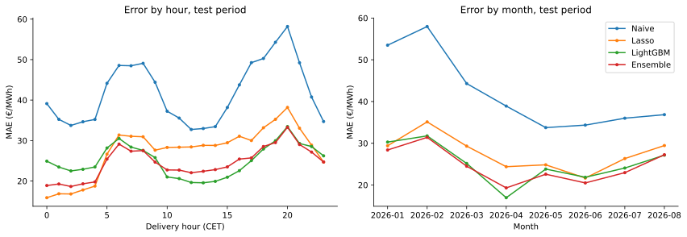

*Figure 9. Forecast error by hour and month.* Highest at 20 CET (33 €/MWh) and in February (31.4 €/MWh) ([03 §5.2](notebooks/03_forecast.ipynb)).

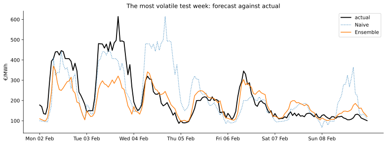

*Figure 10. Forecast and actual prices, February 2–8, 2026.* A peak of about 615 €/MWh against a forecast of 330–380 €/MWh ([03 §5.2](notebooks/03_forecast.ipynb)).

## 9. Tuned on autumn 2025, an improved model cut the error by a further 4% in September 2026

An improved version (v2) forecast September 1–26, 2026, a period no decision used, with an error of 32.8 €/MWh against 34.2 €/MWh for the main model (−4%; Diebold–Mariano p = 0.041, Giacomini–White p = 0.19; [03 §8.3](notebooks/03_forecast.ipynb)). In January–August, which had been seen before v2 was built, v2 was 6.9% better (22.9 against 24.6 €/MWh) and better in each of the nine months from January to September, by 2% (February) to 16% (April).

Faster adaptation did most of the work. All v2 settings were chosen on October–December 2025. Lasso models trained on the last 56 and 84 days, averaged with 364- and 728-day models, cut the validation error by 7.6%; the new inputs alone made Lasso 1.4% worse. LightGBM with the change in residual load since yesterday and two recency weightings cut the validation error by 4.4%. The change in residual load since yesterday entered LightGBM's 15 most important inputs for Lithuania, the Nordic region and Germany; cross-border capacities, yesterday's forecasts and a carbon price proxy each carried under 1% of the gain.

Against a forecast that repeats the same hour a week earlier, v2's error ratio is 0.45 in January–August and 0.38 in September, against roughly 0.4–0.6 for the best models in a five-market benchmark study (Lago et al., 2021).

## 10. The forecast got tomorrow's direction right on 88.5% of days; its 80% intervals covered 68–74% of hours

v2 forecast whether tomorrow's average price would be above or below today's correctly on 88.5% of days in both test periods ([03 §10](notebooks/03_forecast.ipynb)).

| v2 forecast | January–August 2026 | September 2026 |
|---|---|---|
| Hours within ±20 €/MWh of the actual price | 58% | 42% |
| Median hourly error | 16.4 €/MWh | 25.1 €/MWh |
| Correct direction of tomorrow's average price against today's | 88.5% | 88.5% |
| Most expensive hour found within ±1 hour | 74% | 50% |
| Cheapest hour found within ±1 hour | 51% | 42% |

The 80% prediction intervals contained the actual price in 74% of hours in January–August and 68% in September, 6 and 12 percentage points short of 80% ([03 §9](notebooks/03_forecast.ipynb)). Each interval is estimated from the previous 56 days, so when volatility jumps – repeating yesterday's prices erred by 79.6 €/MWh in September against 41.8 €/MWh in January–August – the intervals are too narrow.

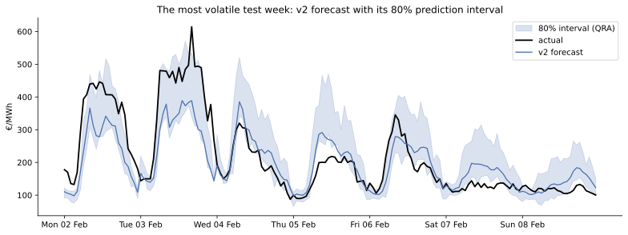

*Figure 11. v2 forecast with its 80% prediction interval, February 2–8, 2026.* The interval did not reach the peak ([03 §9](notebooks/03_forecast.ipynb)).

## 11. A battery scheduled with the forecast earned 89% of the perfect-foresight profit

A 1 MW / 2 MWh battery that charged in the hours v2 predicted to be cheapest and discharged in those predicted to be dearest, settled at the actual prices, earned 89.2% of the profit it would have made knowing the prices in advance in January–August and 85.9% in September, against 77.6% and 60.3% when repeating yesterday's prices ([03 §11](notebooks/03_forecast.ipynb)). The battery runs at most one cycle a day with 88% round-trip efficiency.

| Schedule based on | Share of perfect foresight, Jan–Aug | Share, September | € per MW and year, Jan–Aug | € per MW and year, September |
|---|---|---|---|---|
| Actual prices (perfect foresight) | 100% | 100% | 84,300 | 84,800 |
| v2 forecast | 89.2% | 85.9% | 75,200 | 72,800 |
| Main (pre-registered) forecast | 88.9% | 85.4% | 74,900 | 72,400 |
| Repeating yesterday's prices | 77.6% | 60.3% | 65,400 | 51,100 |

A battery earns from the order of the hours within a day, not from the price level, so v2's 6.9% lower error added only €222 per MW and year in January–August. v2 found the most expensive hour within one hour on 74% of days and the cheapest on 51%, yet all its timing errors together cost €6,100 per MW over January–August, 10.8% of the perfect-foresight profit, because a missed hour was usually replaced by one with a similar price. A simple dispatch rule in the PJM market captured a similar share of perfect-foresight value, about 85% (Sioshansi et al., 2009).

For Ignitis' 291 MW / 582 MWh of batteries at Kelmė, Mažeikiai and Kruonis, due in 2027 (Ignitis Group, 2025; ESS News, 2025), forecast-based scheduling is worth up to €2.8 million a year over repeating yesterday's prices, and v2 over the main model about €65,000 (January–August basis). Both are upper bounds. Repeating yesterday's prices is a benchmark no trading desk uses; 291 MW is about 21% of Lithuania's average load of 1.4 GW, so the batteries will move the prices they trade at, which cut a 1 GW device's arbitrage value by about 10% in PJM (Sioshansi et al., 2009); and the test ignores grid fees, degradation, quarter-hour prices and balancing revenues. September's figures annualize 26 volatile days and are not used for these estimates.

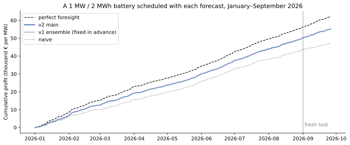

*Figure 12. Cumulative battery profit by schedule.* €55,200 per MW with v2 against €62,200 with perfect foresight ([03 §11](notebooks/03_forecast.ipynb)).

## 12. Knowing the wind that actually blew made the forecast 2.5% worse

Replacing Lithuania's day-ahead wind forecast with the wind output that actually occurred raised the forecast error from 27.1 to 27.8 €/MWh (+2.5%, p = 0.064), and replacing the wind, solar and load forecasts together gave 27.8 €/MWh ([03 §6](notebooks/03_forecast.ipynb)). All variants in this comparison are re-trained monthly, which puts their errors about 2.5 €/MWh above the main model's 24.6 €/MWh. H9 is not supported.

| Information used (re-trained monthly) | Mean absolute error, €/MWh | Change against ENTSO-E forecasts |
|---|---|---|
| No wind or solar forecasts | 30.3 | +11.7% (p < 0.001) |
| ENTSO-E wind and solar forecasts | 27.1 | reference |
| ERA5 reanalysis wind | 28.4 | +4.9% (p = 0.003) |
| Actual Lithuanian wind | 27.8 | +2.5% (p = 0.064) |
| Actual Lithuanian wind, solar and load | 27.8 | +2.6% (p = 0.054) |

The day-ahead price is set at 12:00 CET on the day before delivery, from bids based on the forecasts traders had then; the result is consistent with the auction pricing these expectations rather than the later outcome. Differences between forecast and outcome are traded afterwards in the intraday market and settled in balancing, where they do move prices (Kiesel & Paraschiv, 2017; Kulakov & Ziel, 2021). The errors of the Lithuanian wind, solar and load forecasts explain 0.1% of the variance of the price forecast's hourly error ([03 §6.1](notebooks/03_forecast.ipynb)), and the 95% interval allows perfect wind knowledge to lower the error by at most 0.04 €/MWh.

The forecasts themselves are valuable: without them the error was 3.2 €/MWh (11.7%) higher. ERA5 reanalysis wind did worse than the grid operators' forecasts (+1.3 €/MWh) because it describes the weather on a grid of about 31 km, not the output of the actual wind farms (Staffell & Pfenninger, 2016; Olauson, 2018).

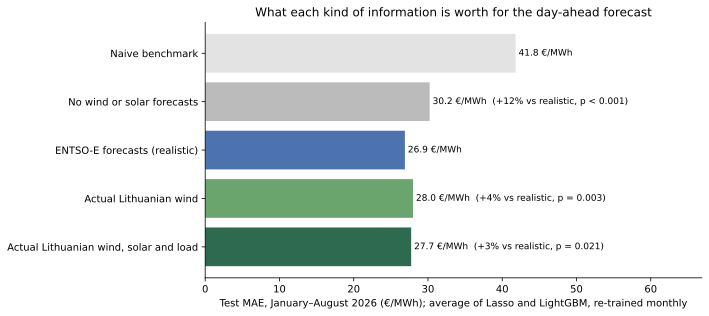

*Figure 13. Forecast error by information set.* The actual wind raised the error from 27.1 to 27.8 €/MWh ([03 §6](notebooks/03_forecast.ipynb)).

## 13. The load forecast's error grew 2.3 times, mostly in solar hours; a 56-day correction cuts it by 30%

Over all hours of each year, the published day-ahead load forecast for Lithuania missed actual load by 59 MW in 2023 and 138 MW in 2026, 2.3 times as much ([03 §8](notebooks/03_forecast.ipynb)). By hour of day, the 2026 error peaked at about 250 MW around 11:00, where it was about 60 MW in 2023, while the night-time error did not change ([03 §1](notebooks/03_forecast.ipynb)). About 170,000 prosumers produced about 70% of Lithuania's solar output in 2025 (pv magazine, 2026); their output lowers the load the grid operator measures at midday, which the forecast does not appear to anticipate.

Subtracting the error that the solar forecast predicted over the previous 56 days cut the 2026 error from 138 to 97 MW (−30%) and the 2025 error from 84 to 75 MW (−11%) ([03 §8](notebooks/03_forecast.ipynb)). In 2024, with less rooftop solar, the correction raised the error from 73 to 77 MW.

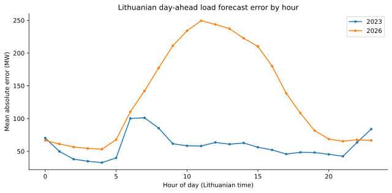

*Figure 14. Load forecast error by hour, 2023 and 2026.* About 250 MW around 11:00 in 2026 ([03 §1](notebooks/03_forecast.ipynb)).

---

## 14. Limits

Four limits bound the numbers above.

1. Realized weather and possibly late forecasts. Notebook 01 uses ERA5 weather that occurred, which biases the wind effect towards zero. Day-ahead wind and solar forecasts may be published up to six hours after the auction (European Commission, 2013); without them the forecast still beats repeating yesterday's prices by 28% ([section 8](#8-a-forecast-from-pre-auction-information-had-a-41-lower-error-than-repeating-yesterdays-prices)).
2. Short test periods. The forecasts were tested on 243 days in January–August 2026, which notebook 01 had already used and which revealed the weaknesses v2 was built to fix, and on 26 clean days in September; a benchmark study recommends at least 365 days (Lago et al., 2021). Using one period for several decisions is a form of data snooping (White, 2000).
3. Incomplete data. ENTSO-E may miss part of the 170,000 prosumers' output, which understates solar volumes more than capture rates, because rooftop panels follow the same daily curve as the measured solar parks. Prices have cleared in 15-minute periods since October 1, 2025, and averaging them to hours hides negative quarter-hours. NordBalt's offered capacity is missing for September 9–26, 2026 (18 days); the model then repeated the last known 700 MW for up to a week, so a maintenance outage reported that month was invisible to it.
4. Simplified economics. The battery test runs one cycle a day, without fees, degradation, price impact or balancing revenues. The curtailment estimate averages over market-exposed parks and older parks on fixed tariffs, which have no reason to stop (European Commission, 2014, §3.3.2).

## 15. Next steps

Any new model version would need to be tested on data after September 26, 2026. At September's volatility, about 50 days (seven weeks) of new data give an 80% chance of detecting a 1.35 €/MWh improvement; 365 days are needed to cover every season.

1. Forecasting what a desk trades: the spread between day-ahead and imbalance or intraday prices, and price spreads between Lithuania and Estonia, Sweden and Poland, judged by euros earned. Imbalance prices are available from the ENTSO-E interface used here.
2. Adding the inputs that explain spikes: neighbors' actual output (Poland first), REMIT outage messages, interconnector availability and weather forecasts as published before the auction.
3. Calibrating the intervals with conformal prediction (Kath & Ziel, 2021), testing their coverage formally (Kupiec, 1995; Christoffersen, 1998), and modeling spike risk directly (Marcjasz et al., 2023).
4. Moving to quarter-hours, the resolution of the day-ahead market and of battery revenues since October 2025.
5. Measuring Nordic hydro from weather: precipitation, snow and runoff anomalies over Swedish and Finnish catchments, at weekly frequency.

---

## Appendix A. Data and methods

### A.1 Data

| Source | Variables | Period |
|---|---|---|
| ENTSO-E Transparency Platform | day-ahead prices for LT, LV, EE, FI, SE4 and PL; Lithuanian generation, load and day-ahead forecasts; load, wind and solar forecasts for LV, EE, FI, SE3, SE4, PL and DE-LU; Nordic reservoir levels (from 2015); capacity offered on ten Baltic border directions | January 2023 – September 2026 |
| ERA5 reanalysis (Copernicus) | 100 m wind, 2 m temperature and solar radiation, converted into wind capacity-factor indices for nine countries | January 2023 – August 2026 |
| Yahoo Finance | TTF front-month gas (`TTF=F`); a carbon-allowance ETF as a carbon price proxy (`KRBN`) | December 2022 – September 2026 |

The raw data are processed with DuckDB and SQL into one hourly table: `lt_hourly` (January 2023 – August 2026, fixed for notebooks 01–02) and `lt_hourly_all` (all hours, used by notebook 03). Quality checks find no missing Lithuanian price hours, no duplicate rows and no gaps in the ERA5 series; 174 faulty load-forecast hours and 7 incomplete hydro weeks are excluded.

### A.2 Notebook 01: price drivers

- Model. Ordinary least squares of the hourly price on Baltic, Nordic and Continental wind (ERA5 capacity factors), solar radiation, the load forecast, gas and Nordic hydro relative to its 2015–2022 weekly normal, with hour, weekday, month and year effects; Newey–West standard errors with 48 lags (Newey & West, 1987).
- Units. Wind in % of capacity (effects shown per +10 percentage points), solar radiation in 100 W/m², the load forecast in GW (shown per +100 MW), gas in €/MWh and hydro in TWh, so every coefficient reads as a change in €/MWh.
- Identification. Weather does not respond to the market, while actual wind output does (farms stop at negative prices). Imports and neighboring prices are left out because they carry part of the wind effect.
- The five checks behind [section 2](#2-a-typical-windy-hour-was-17-mwh-19-cheaper-than-a-typical-calm-one). (1) Placebo: wind one week later, which cannot affect today's price, has a coefficient of +0.74 €/MWh (p = 0.064) while today's wind keeps −7.56 ([01 §8.2](notebooks/01_price_drivers.ipynb)). (2) Deciles: the price falls in each of the ten wind deciles in turn (rank correlation −1.00; [01 §8.3](notebooks/01_price_drivers.ipynb)). (3) Instrumental variables: with ERA5 wind as an instrument for actual Lithuanian output, 100 MW of wind lowers the price by 2.78 €/MWh (first-stage F = 639), against 3.09 €/MWh from ordinary regression, so the feedback from price to output shifts the estimate by 10% ([01 §8.5](notebooks/01_price_drivers.ipynb)). (4) Out of sample: fitted on 2023–2025 and applied to January–August 2026, the model's mean absolute error rose from 30.2 to 34.4 €/MWh, and dropping wind and solar raised it to 40.4 €/MWh ([01 §8.14](notebooks/01_price_drivers.ipynb)). (5) Leave one year out: the wind effect stays between −5.9 and −9.0 €/MWh ([01 §8.14](notebooks/01_price_drivers.ipynb)).
- Further checks. Before and after synchronization; median regression (−6.1 €/MWh); month-clustered errors for slow variables; a finer regional split; indicators for the 2025 events; per-year instrumental-variable estimates; tight hours.

### A.3 Notebook 02: value of wind and solar

- Curtailment (H6). Expected wind output from a monthly line between the ERA5 index and actual output, fitted on hours with a non-negative price; negative-price hours compared with hours priced at 10 €/MWh or more that have the same expected output; the 0–10 €/MWh band as a placebo; errors clustered by month (Cameron & Miller, 2015).
- Capture rates (H7). Output-weighted average price divided by the average price of all hours, by year, by January–August period and by month; the trend estimated on monthly rates with month-of-year effects, weighted by output.

### A.4 Notebook 03: forecasting

- Information set. What is known at 12:00 CET on the day before delivery: prices of the three previous days and of a week earlier, neighbors' prices of the day before, day-ahead load, wind and solar forecasts for Lithuania and five neighboring regions, gas and carbon closes two days before, Nordic hydro published at least 11 days before, holidays and the Estlink 2 outage. Days follow the auction's CET clock, and automatic checks confirm that no input uses later information – apart from the possible late publication of wind and solar forecasts ([section 14](#14-limits)).
- Models. Repeating yesterday's prices (last week's on Mondays and weekends); Lasso (Tibshirani, 1996) with one model per delivery hour (Uniejewski et al., 2016; Lago et al., 2021); LightGBM (Ke et al., 2017); and their average, fixed in advance as the main model. Prices are transformed with a scaled inverse hyperbolic sine before training (Uniejewski et al., 2018).
- Evaluation. Training to September 2025; settings chosen on October–December 2025; forecasts day by day for January–August 2026 and September 1–26, 2026, re-training Lasso daily and LightGBM weekly (daily in v2). Diebold–Mariano (Diebold & Mariano, 1995) and Giacomini–White (Giacomini & White, 2006) tests compare models on daily errors.
- Uncertainty and value. 80% intervals by quantile regression averaging (Koenker & Bassett, 1978; Nowotarski & Weron, 2015), scored by coverage and pinball loss; a battery schedule optimized each day by linear programming on the forecast prices and settled at the actual prices.

## Appendix B. Hypotheses and verdicts

| | Hypothesis | Verdict | Evidence | Section |
|---|---|---|---|---|
| H1 | Stronger wind in the Baltic states lowers the Lithuanian day-ahead price, holding demand, solar, gas, Nordic hydro and calendar effects fixed. | Supported | −7.6 €/MWh per +10 percentage points (95% CI −8.5 to −6.7) | [2](#2-a-typical-windy-hour-was-17-mwh-19-cheaper-than-a-typical-calm-one) |
| H2 | The effect of Baltic wind on the price has grown from 2023 to 2026 as installed wind capacity increased. | Partly supported | −5.3 €/MWh in 2023 → −7.6 in 2026 (p = 0.04), but −11.1 in 2025, when Estlink 2 was out | [4](#4-while-estlink-2-was-out-the-same-wind-was-associated-with-a-68-larger-price-reduction-added-turbines-did-not-change-the-effect) |
| H3 | Nordic and Continental wind also lower the Lithuanian price; without them the Baltic wind effect is overstated. | Supported | without them, the Baltic effect reads −11.4 instead of −7.6 €/MWh | [3](#3-neighbors-wind-moves-the-lithuanian-price-98-as-much-as-baltic-wind) |
| H4 | Wind lowers the price more when natural gas is expensive, because it displaces gas-fired plants. | Not supported | −7.0 €/MWh at 28 €/MWh gas, −7.8 at 52 (p = 0.39) | [5](#5-gas-prices-and-nordic-hydro-did-not-change-the-wind-effect) |
| H5 | More water than normal in Nordic hydro reservoirs lowers the Lithuanian price. | Not supported | +5.0 €/MWh per +10 TWh, p = 0.049 when clustered by month | [5](#5-gas-prices-and-nordic-hydro-did-not-change-the-wind-effect) |
| H6 | In hours with a negative price, wind farms produce less than the wind would allow, because some farms stop to avoid losses. | Supported | 18% lower output (95% CI 10–26%), 0.9% in the 0–10 €/MWh placebo band | [7](#7-wind-farms-held-back-18-of-their-output-at-negative-prices-08-of-their-2025-production) |
| H7 | The capture rates of wind and solar are below 1 and fell over 2023–2026; solar's is lower and falls faster. | Partly supported | solar −8.4 percentage points a year; wind +0.25 (p = 0.74) | [6](#6-solars-capture-rate-fell-from-087-to-054-in-the-same-months-of-2023-and-2026-winds-did-not-fall) |
| H8 | A model that uses only information available before the auction forecasts tomorrow's hourly prices more accurately than a naive benchmark (Diebold–Mariano p < 0.05). | Supported | 24.6 against 41.8 €/MWh (p < 0.001) | [8](#8-a-forecast-from-pre-auction-information-had-a-41-lower-error-than-repeating-yesterdays-prices) |
| H9 | Replacing Lithuania's wind forecast with the wind output that actually occurred makes the price forecast more accurate. | Not supported | 27.8 against 27.1 €/MWh (p = 0.064) | [12](#12-knowing-the-wind-that-actually-blew-made-the-forecast-25-worse) |

H9 was re-specified during the analysis: the first design used ERA5 wind as the "perfect" information, which measured wind output less accurately than the grid operators' forecasts (28.4 against 27.1 €/MWh).

## Appendix C. References

### Academic literature

- Cameron, A. C., & Miller, D. L. (2015). A practitioner's guide to cluster-robust inference. *Journal of Human Resources*, 50(2), 317–372. https://doi.org/10.3368/jhr.50.2.317
- Christoffersen, P. F. (1998). Evaluating interval forecasts. *International Economic Review*, 39(4), 841–862.
- Diebold, F. X., & Mariano, R. S. (1995). Comparing predictive accuracy. *Journal of Business & Economic Statistics*, 13(3), 253–263.
- Giacomini, R., & White, H. (2006). Tests of conditional predictive ability. *Econometrica*, 74(6), 1545–1578.
- Hersbach, H., et al. (2020). The ERA5 global reanalysis. *Quarterly Journal of the Royal Meteorological Society*, 146(730), 1999–2049. https://doi.org/10.1002/qj.3803
- Hirth, L. (2013). The market value of variable renewables: The effect of solar wind power variability on their relative price. *Energy Economics*, 38, 218–236. https://doi.org/10.1016/j.eneco.2013.02.004
- Kath, C., & Ziel, F. (2021). Conformal prediction interval estimation and applications to day-ahead and intraday power markets. *International Journal of Forecasting*, 37(2), 777–799. https://doi.org/10.1016/j.ijforecast.2020.09.006
- Ke, G., Meng, Q., Finley, T., Wang, T., Chen, W., Ma, W., Ye, Q., & Liu, T.-Y. (2017). LightGBM: A highly efficient gradient boosting decision tree. *Advances in Neural Information Processing Systems*, 30.
- Kiesel, R., & Paraschiv, F. (2017). Econometric analysis of 15-minute intraday electricity prices. *Energy Economics*, 64, 77–90.
- Koenker, R., & Bassett, G. (1978). Regression quantiles. *Econometrica*, 46(1), 33–50.
- Kulakov, S., & Ziel, F. (2021). The impact of renewable energy forecasts on intraday electricity prices. *Economics of Energy & Environmental Policy*, 10(1), 79–104. https://doi.org/10.5547/2160-5890.10.1.skul
- Kupiec, P. H. (1995). Techniques for verifying the accuracy of risk measurement models. *Journal of Derivatives*, 3(2), 73–84.
- Lago, J., Marcjasz, G., De Schutter, B., & Weron, R. (2021). Forecasting day-ahead electricity prices: A review of state-of-the-art algorithms, best practices and an open-access benchmark. *Applied Energy*, 293, 116983. https://doi.org/10.1016/j.apenergy.2021.116983
- Marcjasz, G., Narajewski, M., Weron, R., & Ziel, F. (2023). Distributional neural networks for electricity price forecasting. *Energy Economics*, 125, 106843.
- Newey, W. K., & West, K. D. (1987). A simple, positive semi-definite, heteroskedasticity and autocorrelation consistent covariance matrix. *Econometrica*, 55(3), 703–708.
- Nowotarski, J., & Weron, R. (2015). Computing electricity spot price prediction intervals using quantile regression and forecast averaging. *Computational Statistics*, 30(3), 791–803.
- Olauson, J. (2018). ERA5: The new champion of wind power modelling? *Renewable Energy*, 126, 322–331. https://doi.org/10.1016/j.renene.2018.03.056
- Sioshansi, R., Denholm, P., Jenkin, T., & Weiss, J. (2009). Estimating the value of electricity storage in PJM: Arbitrage and some welfare effects. *Energy Economics*, 31(2), 269–277.
- Staffell, I., & Pfenninger, S. (2016). Using bias-corrected reanalysis to simulate current and future wind power output. *Energy*, 114, 1224–1239. https://doi.org/10.1016/j.energy.2016.08.068
- Stiewe, C., Xu, A. L., Eicke, A., & Hirth, L. (2025). Cross-border cannibalization: Spillover effects of wind and solar energy on interconnected European electricity markets. *Energy Economics*, 143, 108251. https://doi.org/10.1016/j.eneco.2025.108251
- Tibshirani, R. (1996). Regression shrinkage and selection via the lasso. *Journal of the Royal Statistical Society: Series B*, 58(1), 267–288.
- Uniejewski, B., Nowotarski, J., & Weron, R. (2016). Automated variable selection and shrinkage for day-ahead electricity price forecasting. *Energies*, 9(8), 621.
- Uniejewski, B., Weron, R., & Ziel, F. (2018). Variance stabilizing transformations for electricity spot price forecasting. *IEEE Transactions on Power Systems*, 33(2), 2219–2229. https://doi.org/10.1109/TPWRS.2017.2734563
- White, H. (2000). A reality check for data snooping. *Econometrica*, 68(5), 1097–1126.

### Regulation, market information and news

- AST (2025). *Baltic balancing capacity market launched on February 4, 2025.* https://www.ast.lv/en/node/86619
- Elering (2025). *EstLink 2 back on the market.* https://elering.ee/en/node/3909
- ESS News (2025). *Lithuania's Ignitis Group to add 582 MWh of battery storage projects.* https://www.ess-news.com/?p=5724
- European Commission (2013). Commission Regulation (EU) No 543/2013 on submission and publication of data in electricity markets. *Official Journal of the European Union*, L 163, 1–12. https://eur-lex.europa.eu/eli/reg/2013/543/oj
- European Commission (2014). Guidelines on State aid for environmental protection and energy 2014–2020 (2014/C 200/01). *Official Journal of the European Union*, C 200, 1–55.
- Helsinki Times (2025). *Estlink 2 power link restored after six-month outage.* https://www.helsinkitimes.fi/finland/finland-news/domestic/27201-estlink-2-power-link-restored-after-six-month-outage.html
- Ignitis Group (2025). *Ignitis Group starts building battery energy storage parks in Lithuania.* https://ignitisgrupe.lt/en/news/ignitis-group-starts-building-battery-energy-storage-parks-lithuania
- Ignitis Group (2026). *Ignitis Renewables: Lithuania emerges as a European wind power leader.* https://ignitisgrupe.lt/en/news/ignitis-renewables-lithuania-emerges-european-wind-power-leader
- NEMO Committee (2025). *15-minute MTU in SDAC was implemented.* https://nemo-committee.eu/assets/files/15-minute-mtu-in-sdac-was-implemented.pdf
- pv magazine (2026, March 30). *Lithuania's solar capacity surpasses 3 GW.* https://www.pv-magazine.com/2026/03/30/lithuanias-solar-capacity-surpasses-3-gw/
- World Wind Energy Association (WWEA). *Global Statistics.* https://wwindea.org/GlobalStatistics

### Data and attribution

- ENTSO-E Transparency Platform, https://transparency.entsoe.eu/ – prices, generation, load, forecasts, reservoir levels and offered capacities. Raw data are not included in this repository.
- ERA5 hourly data on single levels (Hersbach et al., 2023; https://doi.org/10.24381/cds.adbb2d47). *Contains modified Copernicus Climate Change Service information 2026. Neither the European Commission nor ECMWF is responsible for any use that may be made of the Copernicus information or data it contains.*
- Yahoo Finance, tickers `TTF=F` and `KRBN`, for personal, non-commercial use; the data are not redistributed. 